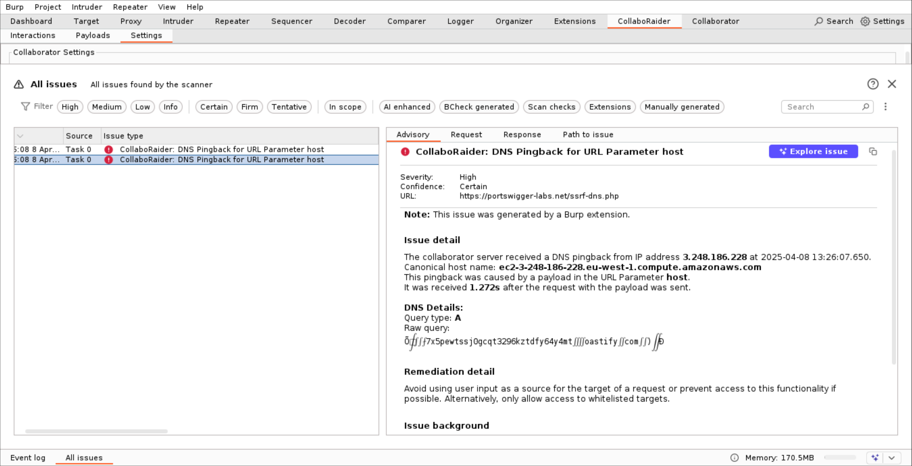
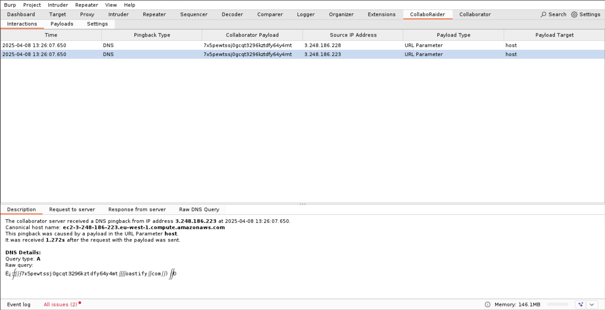
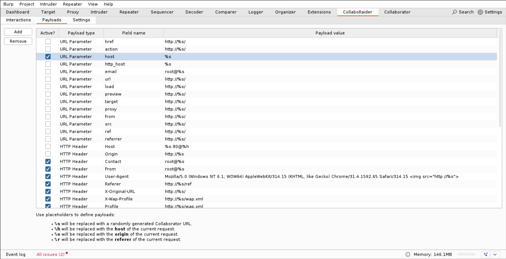
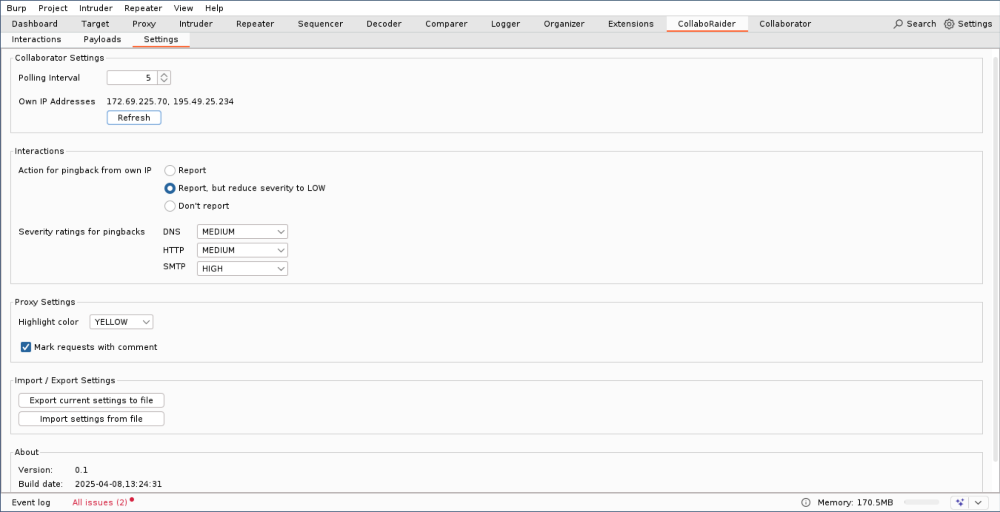

# Description
This extension is an improved version of the popular Burp Extension [Collaborator Everywhere](https://github.com/portswigger/collaborator-everywhere) which was developed by James '[albinowax](https://github.com/albinowax)' Kettle. 
It helps to discover SSRF vulnerabilities and other misconfigurations by automatically injecting Collaborator URLs in various headers or URL parameters. 
If one of these URLs is resolved or fetched by the server, a notification is raised and the received interaction can be analyzed.
Payloads can be easily configured in a new Extension tab. Additionally, all received interactions are listed in a table. 

# Features
All features from the original [Collaborator Everywhere](https://github.com/portswigger/collaborator-everywhere) extension are covered:
- Insert a freshly generated Collaborator payload to certain headers in every request to an in-scope host.
- Raise an issue if a request to one of these Collaborator URLs has been received.
- Display detailed information about the request in the issue and which payload caused it.
- Show time difference between the original request and the received interaction.
- Check own external IP address and add a disclaimer if the interaction was received from the own address.
- Includes payloads to modify HTTP header fields and URL parameters.
- Payloads can be constructed with a placeholder that is replaced with the Host header value of the original request.

New features:
- Payloads can be added, modified, deleted, enabled or disabled in a new tab.
- Additionally, payloads can be imported from a file. See [payloads](payloads) for examples.
- All received interactions are displayed in a new tab similar to the built-in Collaborator, with more details provided for individual entries.
- Requests that caused an interaction are highlighted in the Proxy history.
- Added new placeholders to use the value of the Origin and Referer header fields in a payload.
- Interactions are stored persistently in the project file.
- Settings are stored in Burp's user settings and survive a reload of the extension.
- The extension is based on the new Montoya API.

# Installation
## Manual Installation
In Burp Suite, open the `Extensions` tab and navigate to the `Installed` sub-tab. There, select the extension type `Java` and select the Jar file.
## From BApp Store
hopefully coming soon...

# Usage
## Issues
If a pingback is received, an issue is raised:

## Interactions tab
The Interactions tab shows all received pingbacks. When a row is selected, more details are shown below.

## Payloads tab
Payloads can be configured in the Payloads tab. They can be enabled or disabled though the checkbox, or edited by double-clicking a cell. Further, new payloads can be added or existing payloads be removed.

## Settings tab
This tab allows further configurations.

# Credits
The original Burp Extension [Collaborator Everywhere](https://github.com/portswigger/collaborator-everywhere) was initially created as a proof-of-concept for [Portswigger's blog post](https://portswigger.net/research/cracking-the-lens-targeting-https-hidden-attack-surface) on hidden server-side vulnerabilities. However, despite its popularity, the extension is quite old and no longer maintained, with the last commit being three years ago. This motivated me to rewrite the extension using the new Montoya API and add a few new features that I missed during previous pentesting assessments.

Furthermore, Portswigger's example project repository contains a great [demo project](https://github.com/PortSwigger/burp-extensions-montoya-api-examples/tree/main/collaborator) that explains how to work with a custom Collaborator client, which served as starting point for this extension.

# License
See [LICENSE](LICENSE) file (MIT License).

# Author
- Andreas Brombach (GitHub: [dec1m0s](https://github.com/dec1m0s))

